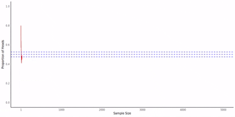

# Law of large numbers demo 

This repository contains `R` code with an accompanying Dockerfile to run an animated simulation of the law of large numbers which tells us that the sample mean converges to the population mean in probability. I specifically model the following scenario. 

- Flip a fair coin
- If the coin lands heads, then call it a success
- Flip again and count the number of consecutive heads
- Repeat 5000 times
- At each step compute the share of heads

We find that the sample mean converges to the population mean which I set to $\frac{1}{2}$.

<p align="center">
<!--  -->
    
</p>

## How to run

To run the code in this repository first build and run the `docker` image. Then run the `R` script.

```bash
cd donuts-qpm
sudo docker build -t nathanenglehart/donuts-qpm .
sudo docker run -it nathanenglehart/donuts-qpm
Rscript animate_mu.r
```

The `mp4` file can be recovered by opening another terminal and running.

```bash
sudo docker cp container-id:/app/mu_animation.mp4 /path/to/mu_animation_1.mp4
```

The container id can be obtained by running `sudo docker ps`. To exit to the `docker` image, simply type `exit`.

I created the `gif` above using `ffmpeg`. 

```bash
ffmpeg -i mu_animation_1.mp4 -vf "fps=20,scale=800:-1:flags=lanczos" mu_animation_3.gif
```


